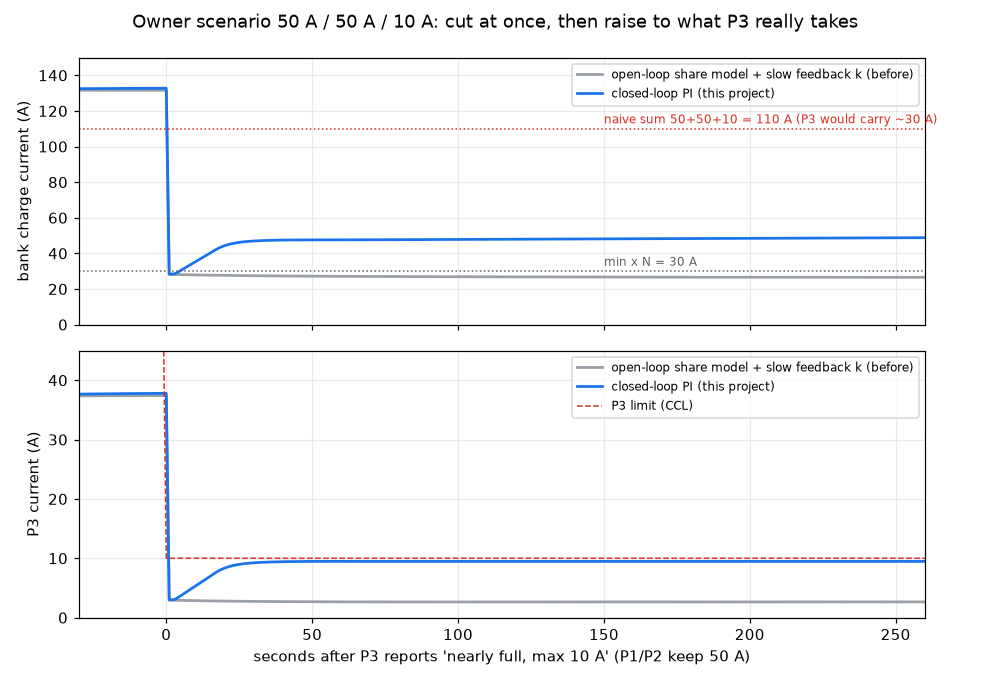

# battery-aggregator

**DE** – Virtuelle Batterie für Victron Venus OS aus mehreren parallelen LiFePO4-Packs (je ein JK-BMS über
dbus-serialbattery). Kern in reinem Python ohne D-Bus und ohne Fremdabhängigkeiten (Python ≥ 3.10, Venus nutzt 3.12),
dünner D-Bus-Adapter folgt. Bank-Limits werden pro Pack über dessen Stromanteil berechnet
(`min_i (L_i − c_i)/s_i`, gedeckelt durch Σ, Hardwaregrenze und N-1-Kaskadenprüfung), ein Pack-Ausfall bringt
den Dienst nicht zum Absturz. Erste Phase auf dem Gerät: Schattenbetrieb (`docs/05_SHADOW_MODE.md`).

**EN** – Virtual battery for Victron Venus OS built from several parallel LiFePO4 packs (one JK-BMS each via
dbus-serialbattery). Pure-Python core without D-Bus or third-party deps; a thin D-Bus adapter follows. Bank limits are
derived per pack from its current share, capped by the sum, a hardware cap and an N-1 cascade check; losing a pack
never crashes the service. First on-device phase: shadow mode.

> Sicherheitsrelevant. Bis die Stromanteile gemessen sind, bleibt `measured_shares_verified = false`; der
> statische Deckel (DCL 59 A, SR-21) greift im Regelkreis-Modus nur, solange eine Pack-Strommessung fehlt oder
> veraltet ist (D6). CCL ist immer durch die Wechselrichtergrenze 210 A gedeckelt (D5).

## Why this aggregator is different

### 1. Closed-loop per-pack limit protection

Parallel packs never share current exactly by capacity: a pack near the top knee has a higher open-circuit
voltage and takes *less* than its share, a pack with shorter cables takes *more*. Classic aggregators either add
up the limits (unsafe) or take the smallest limit for the whole bank (wasteful). Here the bank limit is
**driven by what the weakest pack really carries**:

> Packs 1 and 2 each say 50 A, pack 3 says "nearly full, max 10 A". Allowing 110 A would push ~30 A into
> pack 3; allowing 3 x 10 A = 30 A throws away most of packs 1 and 2. So: if more than 10 A flows into
> pack 3 (say 15 A), cut **drastically** (110 -> 55 A), check again, cut further if needed, otherwise raise
> slowly again.

- **Feedforward:** the conservative share model `min_i (L_i - c_i) / s_i` (sum, N-1, inverter and hardware
  caps on top) is the starting point; a pack lowering its limit acts in the same cycle.
- **Feedback:** per direction, a PI controller on the worst pack's measured utilisation `u = I_pack / I_limit`
  with setpoint 0.95. **Asymmetric:** above the limit the headroom is cut at once, proportional to the
  overshoot (15 A at a 10 A limit halves it); below the setpoint the limit rises slowly and rate-limited, and
  only while the limit actually binds (anti-windup). Bounded by a sum-safe floor and the hard caps; no gain
  above the model without live, fresh measurements of every pack.
- Simulated (`python -m battery_aggregator.tools.control_sim`): with the 50/50/10 A bank the loop settles at
  **~48.5 A with pack 3 at 9.5 A** where the open-loop model stayed at 25.7 A; after a 50 -> 10 A limit step
  pack 3 is back under its limit after one cycle. Tuning and the full before/after table: `docs/02_DESIGN.md`
  section 4.2a, scenarios S41-S48 in `docs/03_SZENARIEN.md`.



### 2. A pack going offline never crashes the service

Every pack runs through its own state machine (ACTIVE / STALE / OFFLINE / QUARANTINE / UNTRUSTED / GONE). When a
pack disappears, limits are **recomputed** for the remaining packs (its last values are kept as a conservative
"uncertain world" until it is gone), the controller resets without ever jumping up, and the bank keeps running.

### 3. Dynamic D-Bus discovery, no hardcoded pack count

Packs are discovered on the bus and identified by BMS serial (not by `ttyUSBn`); a pack plugged in later joins
after a quarantine period, a pack leaving is renormalised out. The pack count is never hardcoded (an optional
`expected_pack_count` only raises an alarm and a degraded status).

**Credit:** the idea of reducing per-pack limits linearly (instead of switching them off) comes from the owner's
contribution to dbus-serialbattery (author: Waldemar Fech); this closed loop builds on it at bank level.

## Layout

```
src/battery_aggregator/
  config.py       Konfiguration + harte Grenzen        model.py      Snapshot, Validierung, Enums
  pack_state.py   Zustandsautomat je Pack (Serial-ID)  shares.py     Anteilsschätzer (konservativ)
  limits.py       Pack-Taper, Bank-Limit, N-1          evidence.py   Lade-/Entladepfad, Trennung, HV-Latch
  cvl.py          CVL + Zellregler                     soc.py        SoC, Drift, Kalibrierung
  alarms.py       Zell/Temp-Extreme mit Pack-ID        ratelimit.py  Rampen/Hysterese, Überstrom-Rückkopplung
  control.py      Regelkreis je Pack-Limit (PI)        tools/control_sim.py  Regelkreis-Analyse + Plot
  core.py         step(snapshots, now) -> outputs      fault.py      FAULT-Modus, Neustartanforderung
  outputs.py      BankOutputs/D-Bus-Pfade              persistence.py atomare state.json
  sim.py          Closed-loop-Simulator (Tests)        adapter/      Pfadvertrag, FakeBus, Shadow/Live-Publisher,
  main.py         Dienst-Einstieg (GLib, Watchdog)                    velib_bus.py (echter Venus-Bus, VERIFY)
  selftest.py     Selbsttest auf dem Ziel-Python       tools/        1-Hz-Recorder (Cerbo), Replay (PC)
scripts/          install.sh, activate.sh, rollback.sh, boot.sh, daemontools service/ (alle mit --dry-run)
config/           config.example.json (Schattenbetrieb)
tests/            48 Szenarien (S01–S48, Regelkreis S41–S48 in test_closed_loop.py) + Review-Fixes B1/M1–M6, Property-Tests (feste Seeds), Adapter, Tools/Skripte
docs/             00–04 Konklave, 05 Schattenbetrieb, 06 Inbetriebnahme-Runbook, DECISIONS.md
```

## Tests

```
python -m pytest -q
```

## Abweichungen vom Design (Kurzfassung) / deviations

- Entscheidungen D1–D4 (dcl_emergency 90 A, Mindestanteil 0,8/N, Blind-Laden ab 10 °C, HW-/OCP-Werte als Pflicht-Inbetriebnahmeeingaben): `docs/DECISIONS.md`.
- N-1 gilt auch bei N = 2 (SR-01): S05/S14/S16 ergeben 250 A (OCP) statt 300 A.
- S24: Minimum über alle Ausfälle k liefert 109,7 A (Ausfall P2), Dokument nennt 111 A (Ausfall P3);
  ebenso FMEA-Beispiel T-S01: 287,1 A statt 295 A.
- S22: 81,0 A statt 80,7 A (Dokument rundet s auf 0,54); bereits ab STALE (10 s) statt erst ab 30 s (min beider Welten).
- S16: SR-07 (kein Laden < 5 °C) hat Vorrang vor dem Designbeispiel (86 A bei 3 °C); mit `t_charge_min_c = 0` reproduziert.
- Zellregler beschränkt CVL nur oberhalb `v_cell_target` (die Formel mit `max(0, …)` würde CVL sonst auf V_bus einfrieren).
- Rückkopplungsfaktor wirkt nach dem SR-21-Deckel (sonst wirkungslos, solange der Deckel bindet).
- Pack-Limit-Schutz ist ein geschlossener Regelkreis (`control.py`, Design §4.2a): das Anteilsmodell ist nur Anker/
  Vorsteuerung, die publizierte Grenze folgt der gemessenen Auslastung des schwächsten Packs (alte Rückkopplung als
  `limit_control = "legacy"`). S10: P1 ≤ 5 % über dem Limit, k ≈ 0,76.
- Gelernte Kreisstrom-Offsets gehen in die Formel ein (S08 „Limits unverändert“ gilt nur im selben Takt).
- Review-Fixes (Branch fix/review-b1-m6): Lade-/Entladepfad nur aus expliziten FET-/Allow-Flags, nie aus dem Strom
  (B1, S05/S23 angepasst); Serial-Bindung je Service, Platzhalter-Serials und Serial-Konflikte → UNTRUSTED (M1);
  blinde Packs liefern nur eine statische CVL-Kappe aus ihren letzten Live-Werten (M2); Zellregler mit Boden
  3,35 V/Zelle und Anti-Windup ohne Ladestrom (M3); CVL-Max 3,55 V/Zelle nur absenkbar (M4); Temperatur 0/10/40/45 °C
  (M5, S16 angepasst); `/Connected = 0` → sofort OFFLINE, STALE = wie OFFLINE behandelt (M6).
- Offline-/Untrusted-Packs fließen bis GONE mit ihren letzten Werten als „unsichere Welt“ ein (SR-02).

## Lizenz

Apache-2.0, siehe `LICENSE` und `NOTICE`. Ideen/Testfälle aus pulquero/BatteryAggregator und Dr-Gigavolt/dbus-aggregate-batteries
(beide MIT); es wurde kein Code übernommen.

## Release status

- **Tested:** 304 tests passed (`python -m pytest -q`, 2026-10-09), including replayed real Venus OS battery data.
- **Open:** validated on a single Victron Cerbo GX installation; other BMS brands, topologies and Venus OS versions are untested; no independent safety review - use at your own risk and keep the BMS protections as the last line of defence.
